# Tech Lab Management System

A desktop application for universities to manage access to multiple technology laboratories, equipment usage, safety inductions, bookings, approvals, and analytics. Built with C#/.NET and WPF, organized with a separation of Core domain models, Services, UI, and Tests.

## Table of Contents

- Project Overview
- Architecture at a Glance
- Key Features
- Getting Started
- Default Accounts
- How to Use
- Build and Test
- Project Structure
- Technical Notes
- Acknowledgments

## Project Overview

Modern universities operate many specialized tech labs (e.g., Electrical Lab, Mixed Reality Lab, Multimedia Data Analytics Lab, Robotics Lab, Acoustic Lab, Micro & Nanoscale Lab, Geotechnology Lab, etc.). Each lab hosts unique, potentially hazardous equipment (e.g., soldering stations in Electrical, motion platforms in Mixed Reality). To protect people and assets, access must be controlled and auditable.

This system provides:

- Role- and grant-based authorization to labs and equipment
- A guided access request flow with a mandatory safety induction test per lab
- A booking scheduler with conflict detection for labs and equipment
- An approvals hub for managers and professors to review requests
- Usage analytics for oversight and planning

Roles typically include Admin, Professor (lab owner), Technical Lab Manager, Academic Lab Manager, Supervisors, Researchers, Students, and Staff. Users request access to specific labs with justification (and team association if applicable), pass the induction test, and await approval. Equipment usage can also require supervision/privileges. Bookings are coordinated to avoid conflicts across teams sharing facilities.

## Architecture at a Glance

The solution separates domain contracts from implementations and UI, enabling future replacement of the in-memory store without impacting features.

```mermaid
flowchart LR
    subgraph Core [TechLabManagement.Core]
        I1[IAuthService]
        I2[IAuthorizationService]
        I3[IAccessService]
        I4[ISchedulingService]
        I5[IAnalyticsService]
        I6[IRepository&lt;T&gt;]
        M1[(Models: User, Lab, Equipment, Booking, AccessRequest, AccessGrant, UserRole, Permission)]
    end

    subgraph Services [TechLabManagement.Services]
        S1[AuthService]
        S2[AuthorizationService]
        S3[AccessService]
        S4[SchedulingService]
        S5[AnalyticsService]
        S6[Repositories: InMemoryRepository&lt;T&gt;]
        S7[Security: PasswordHasher]
        S8[Policies: AccessPolicies]
        S9[Seed: SampleDataSeeder]
    end

    subgraph App [TechLabManagement WPF]
        UI1[Views: Dashboard, Labs, Access Request Wizard, Booking, Approvals, Analytics, Login]
        UI2[ViewModels: DashboardVM, LabsVM, AccessRequestWizardVM, BookingVM, ApprovalsVM, AnalyticsVM]
        UI3[ServiceLocator: wiring + sample data]
    end

    subgraph Tests [TechLabManagement.Tests]
        T1[AuthTests]
        T2[AuthorizationTests]
        T3[SchedulingServiceTests]
        T4[InMemoryRepositoryTests]
    end

    Core --> Services
    Services --> App
    App -->|consumes| Core
    Tests -->|validates| Services
    UI3 --> Services
```



## Key Features

- Authentication with secure password
- Role-/grant-based authorization for lab entry and equipment usage
- Access Request wizard with per-lab Induction Test gating submission
- Approval workflow (approve/reject) with notifications
- Booking scheduler (lab/equipment) with conflict detection
- Analytics dashboards (bookings by role/hour, approval rates, average induction score per lab, equipment hours by ISO week)

## Getting Started

### Prerequisites

- Windows 10/11 (WPF target)
- .NET SDK 8.0+
- Visual Studio 2022 (recommended) or use the .NET CLI

### Clone & Restore

```bash
# clone your repository, then
cd Tech-Lab-Management
dotnet restore
```

### Run (Option 1: Visual Studio)

- Open `TechLabManagement.sln` in Visual Studio 2022
- Set startup project: `TechLabManagement`
- Press F5 (Debug) or Ctrl+F5 (Run)

### Run (Option 2: .NET CLI)

```bash
# build the solution
dotnet build TechLabManagement.sln -c Debug

# run the WPF application
dotnet run --project TechLabManagement/TechLabManagement.csproj -c Debug
```

## Default Accounts (Seed Data)

Use these credentials for quick exploration (seeded in memory at startup):

| Role                  | Username     | Password       |
| --------------------- | ------------ | -------------- |
| Admin                 | `admin`      | `!Haidrone123` |
| Professor             | `professor`  | `prof123`      |
| Technical Lab Manager | `techmgr`    | `tech123`      |
| Supervisor            | `supervisor` | `sup123`       |
| Researcher            | `alice`      | `alice123`     |
| Student               | `bob`        | `bob123`       |

> Tip: On login, the menu adapts to your permissions (e.g., Approvals visible only to authorized roles).

## How to Use

1. Sign in using one of the default accounts above.
2. Navigate via the top menu or the Dashboard quick actions:
   - Labs: browse labs and equipment; request access via the wizard.
   - Access Request: complete Step 1 (lab + reason), Step 2 (induction), Step 3 (review), then submit.
   - Booking: select a resource (lab/equipment), time range, check conflicts, then create booking.
   - Approvals: filter, inspect, and approve/reject pending requests (authorized roles only).
   - Analytics: adjust date range and view charts/tables (export CSV supported).

Validation and safety gates:

- You must pass the induction test of the selected lab before your access request is submitted.
- Booking creation enforces non-overlapping time slots and requires permission to the resource.

## Build and Test

Run tests from Visual Studio Test Explorer or the CLI:

```bash
# run the entire test project
dotnet test TechLabManagement.Tests/TechLabManagement.Tests.csproj -c Debug

# or simply
dotnet test -c Debug
```

Continuous Integration suggestions (optional):

- Restore → Build → Test pipeline using GitHub Actions with `windows-latest` and .NET 8.

## Project Structure

```
Tech-Lab-Management/
├─ TechLabManagement.sln
├─ TechLabManagement/                 # WPF app (Views, ViewModels, App.xaml)
│  ├─ Views/
│  ├─ ViewModels/
│  └─ Services/ServiceLocator.cs      # Composition root / wiring
├─ TechLabManagement.Core/            # Domain models & interfaces
│  ├─ Models/                         # User, Lab*, Equipment*, Booking, Access*, etc.
│  └─ Interfaces/                     # IAuthService, IAuthorizationService, IRepository<T>, etc.
├─ TechLabManagement.Services/        # Implementations
│  ├─ Auth/                           # AuthService, AuthorizationService
│  ├─ Access/                         # AccessService
│  ├─ Scheduling/                     # SchedulingService
│  ├─ Analytics/                      # AnalyticsService
│  ├─ Repositories/                   # InMemoryRepository<T>
│  ├─ Security/                       # PasswordHasher
│  ├─ Policies/                       # AccessPolicies
│  └─ Seed/                           # SampleDataSeeder
└─ TechLabManagement.Tests/           # NUnit tests
```

## Technical Notes

- Passwords are hashed using PBKDF2 (SHA-256, 100k iterations).
- Authorization combines roles with explicit `AccessGrant` records for non-privileged users.
- Scheduling uses a simple interval-overlap algorithm to detect time conflicts.
- Repositories are in-memory for demo; can be swapped for EF Core + a relational DB without UI changes.
- Analytics uses LINQ aggregations and OxyPlot charts in the WPF client.

Security & safety considerations:

- Production deployments should add account lockout, audit logs, MFA/SSO integration, and persistent storage.
- Induction content is lab-specific and should be curated by lab owners/managers.

## Acknowledgments

Made with ❤️ by Mimo
